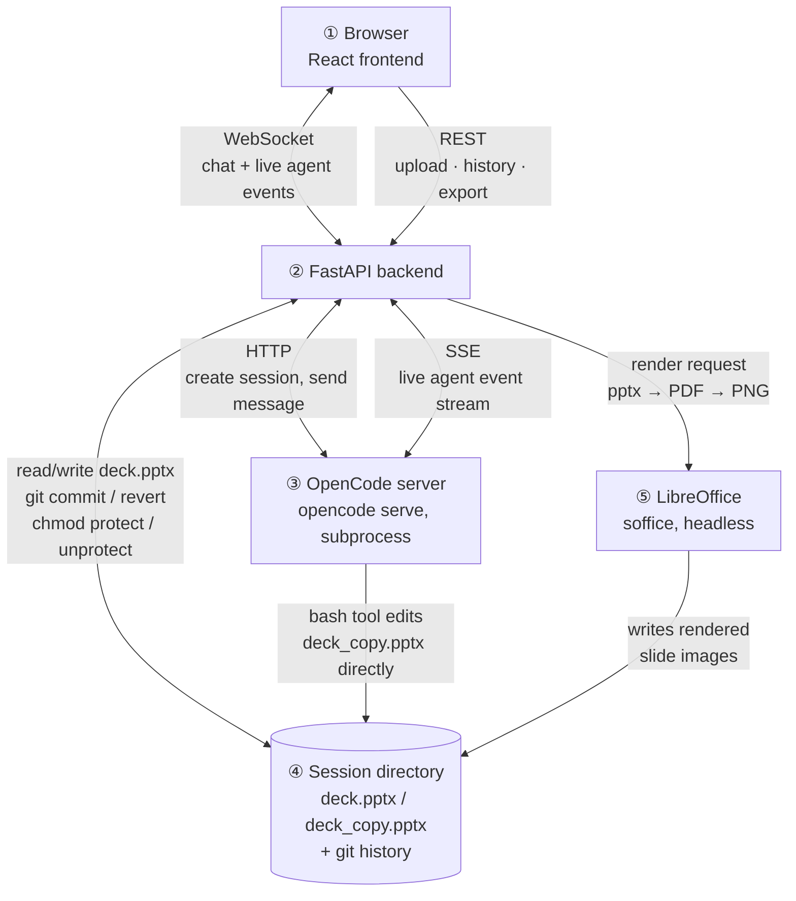

# Architecture

Numbers on each box are referenced the same way in the section headings
below, so you can jump from a piece of the diagram straight to where it's
discussed. OpenCode (③) runs as its own subprocess and, critically, its
bash tool edits files on disk directly — the backend doesn't proxy those
writes. That's exactly why `deck.pptx` needs OS-level protection during a
turn (see "Protecting the real file mid-turn" below): the backend has no
chance to intercept a write happening straight from OpenCode's shell into
the session directory (④).

## System shape `① ② ③`

Three pieces: an **OpenCode server** (`opencode serve`, launched as a
subprocess by the backend) as the actual agent runtime, a **FastAPI
backend** that owns sessions and mediates everything, and a **React
frontend** that renders the cowork-style chat UI. Data flows one way per
turn: a chat message goes in over a websocket, the backend hands it to
OpenCode and streams its raw events straight through to the frontend
live, and once the agent's turn finishes the backend renders the deck
before/after and sends a single review card back — approving or
rejecting it is what actually resolves the turn.

## Session model `④`

One deck per session, one working directory per session, one git repo
per working directory. A session starts empty; the first `.pptx`
uploaded becomes *the* deck for that session, full stop. Uploading a
second `.pptx` mid-session isn't specially guarded against — it just
replaces the current deck and commits that as a new version-history
entry, same as any other change. That's a deliberate choice, not an
oversight: since every state is git-committed, nothing is actually lost;
a second upload landed by mistake is just one more entry to revert past.

## Why a real `.pptx`, not markdown `④`

The first working version of this rendered slides from a Markdown/Marp
source the agent edited as plain text, specifically because a text diff
is trivially reviewable before anything executes. That was abandoned:
Marp's rendering couldn't reliably reproduce the visual design fidelity
a real deck needs — fonts, precise shape placement, native charts, the
things a slide deck actually is. The tradeoff going native was giving up
that pre-execution text diff in exchange for the agent editing the real
binary file (via `python-pptx` run through bash, since OpenCode's own
edit tool can't touch binary files at all). Review moved from "read a
diff before it runs" to "look at rendered before/after images after it
runs" — covered next.

## Human-in-the-loop: draft, review, merge `② ④`

Each turn, the real deck (`deck.pptx`) is copied to a scratch file
(`deck_copy.pptx`) that the agent edits freely via bash — no per-command
approval, no interruptions mid-turn. Once the agent finishes, the backend
renders both files to images and sends one review card: before and after,
side by side, with Approve/Reject. Approve moves the scratch copy over
the real deck and commits once for the whole turn; Reject just discards
the copy. There is exactly one human decision point per turn, and it's
made with full visual context, not a code diff.

## Protecting the real file mid-turn `② ③ ④`

While a turn is in flight, `deck.pptx` is made read-only at the OS level
(`chmod 444`) for the duration, restored afterward regardless of outcome.
This turned out to be the *only* reliable enforcement: OpenCode's own
bash permission patterns were tried first (a `deny` rule naming the exact
protected filename) and confirmed directly, by testing it, to not
reliably block a matching command from writing to the file anyway. An
OS-level permission lock can't be talked around the same way — verified
against a raw shell redirect, a raw Python write, and an actual
`python-pptx` save, all three correctly rejected.

## Version history `④`

Every approved turn is one git commit in the session's own repo — no
extra database, git *is* the history. Revert never rewrites anything: it
restores the deck to a past commit's content and records that restoration
itself as a new, forward-moving commit, so you can always revert past a
revert. Commit messages are generated by the agent itself — the system
prompt asks it to end each turn with a short `Summary: ...` line, which
the backend parses out and uses as the commit subject (falling back to a
generic message if that line is ever missing, so a formatting slip never
blocks a commit). "Hiding" an entry in the sidebar is purely a display
filter — a per-session set of hashes to exclude from what's shown — never
a git operation; nothing is rewritten or deleted, and the current commit
specifically can't be hidden, since the sidebar always needs one visible
"you are here" entry.

## Charts from CSV `② ③`

A CSV attached to a message is available to the agent like any other
file. Charts are built as native PowerPoint chart objects
(`shapes.add_chart`), not rendered images — real, editable charts in the
resulting file. Placement is position-aware: before adding a shape, the
agent is instructed to run a small bundled helper script
(`pptx_helpers.py`, copied into every session directory) that reports
every existing shape's bounding box on the target slide in inches, and to
use that to find genuinely empty space rather than guessing coordinates
or assuming a slide is blank.

## Import / export `② ④`

Export needs no conversion — the working file already is a real `.pptx`
at all times, so exporting is just serving it as-is. Import is closer to
best-effort: a decently-structured deck (real title/body placeholders)
round-trips and edits cleanly, but a freeform, non-placeholder-based
export (e.g. many Google Slides exports, which flatten everything to
anonymous positioned shapes) has no semantic layout for the agent to hook
into — it can still be read, rendered, and have shapes added to it, but
targeted edits like "change the title" become considerably less reliable
without a real title placeholder to find.

## Known limitations `⑤`

- **No content-level diff.** Review is before/after images plus a short
  agent-written summary — not a granular, per-change breakdown of exactly
  what shifted on a slide. A content-based diff system highlighting exactly 
  the changes made would have been ideal and convenient. But it was not a
  critical requirement so I focused on building non negotiable features for 
  this project
- **Some legacy image formats don't render.** Decks with embedded
  EMF/WMF images (an older Windows vector format some tools still export)
  may not render correctly through the LibreOffice/PyMuPDF pipeline.
- **Bash runs unrestricted during a turn.** Only `deck.pptx` itself is
  protected (see above); nothing else in the working directory is scoped
  or sandboxed beyond that.
- **Single user per session, no concurrency handling beyond that.** The
  turn-state machine correctly survives a *reconnect* to the same
  session (browser back/forward, tab reload), but two different people
  editing the same session at once isn't a scenario this handles.
- **Style edits are uneven.** Basic shape and text color changes work
  reliably; theme-wide recoloring, background images, and gradient fills
  might not work reliablly in decks with heavy styling and formatted content .
- **Rendering is whole-deck, every turn.** Fine at demo scale (a dozen or
  so slides); a much larger deck would need incremental re-rendering
  instead of a full LibreOffice pass on every single turn. It works but
  feels noticeably slow due to rerendering content from all slides
