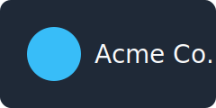

# Quarterly Update

A short deck for exercising the kinds of edits a co-work agent should
handle: prose, bullets, an image, and tabular data.

---

## What shipped this quarter

- Redesigned the onboarding flow, cutting drop-off in half
- Shipped the mobile app to general availability
- Migrated billing to the new provider with zero downtime

---

## Team

We grew from 4 to 7 engineers this quarter, all fully ramped.

---

## Sales by region

| Region | Revenue |
| --- | --- |
| North America | $420k |
| Europe | $310k |
| APAC | $190k |

*(Sourced from `data/sales.csv`.)*

---

## Next quarter

Closing thoughts and priorities for Q3.
